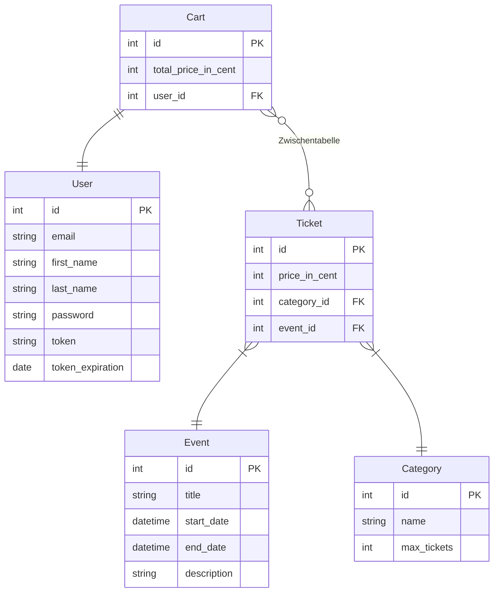

# Data Model

# TODO: CHECK IF MODELS ARE CORRECT

```mermaid
erDiagram
User {
    int id PK
    string email
    string first_name
    string last_name
    string password
    string token
    date token_expiration
}

Event {
    int id PK
    string title
    datetime start_date
    datetime end_date
    string description
}

Category {
    int id PK
    string name
    int max_tickets
}

Ticket {
    int id PK
    int price_in_cent
    int category_id FK
    int event_id FK
}

Cart {
    int id PK
    int total_price_in_cent
    int user_id FK
}

Ticket }|--|| Event: ""
Ticket }|--|| Category: ""
Cart }o--o{ Ticket: "Zwischentabelle"
Cart ||--|| User: ""
```